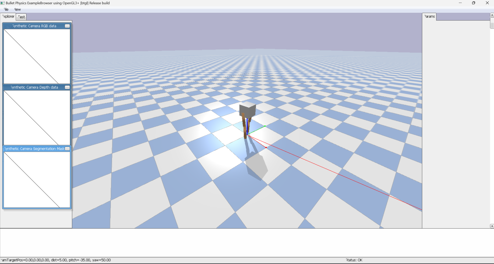

# PyBullet Bipedal Robot with Deep Q-Network (DQN)

This project demonstrates a Deep Q-Network (DQN) implementation for training a bipedal robot in a simulated environment using PyBullet. The robot learns to navigate towards a target while balancing and avoiding falling.

## Requirements

Make sure you have the following dependencies installed:

- Python 3.x
- PyBullet (`pip install pybullet`)
- NumPy (`pip install numpy`)
- PyTorch (`pip install torch`)
- Collections (Included in Python's standard library)
- Time (Included in Python's standard library)
- Random (Included in Python's standard library)

## Project Structure

- **DQN Model**: A neural network with three fully connected layers that estimates Q-values for different actions given the robot's state.
- **Bipedal Robot**: The robot is created using PyBullet's `createMultiBody` function and consists of a base and four joints.
- **State Representation**: The state includes the robot's base position, orientation, velocities, and joint states.
- **Action Space**: The action space is discretized into 16 possible joint movements.
- **Reward Function**: The reward is based on the robot's distance to the target, tilting penalties, and joint movement penalties.

## Training Loop

The training loop follows these steps:

1. **Environment Reset**: The robot is reset to its initial position at the start of each episode.
2. **Action Selection**: Actions are chosen using an ε-greedy strategy, with ε decaying over time.
3. **Simulation Step**: The chosen action is applied to the robot, and the environment is stepped forward.
4. **Reward Calculation**: Rewards are calculated based on the robot's progress towards the target, penalties for tilting, and penalties for falling.
5. **Experience Replay**: A replay memory stores experiences, which are sampled to train the DQN.
6. **Target Network Update**: The target network is updated every 10 episodes to stabilize training.

## Running the Program

To run the program, execute:

```bash
python Robot.py

